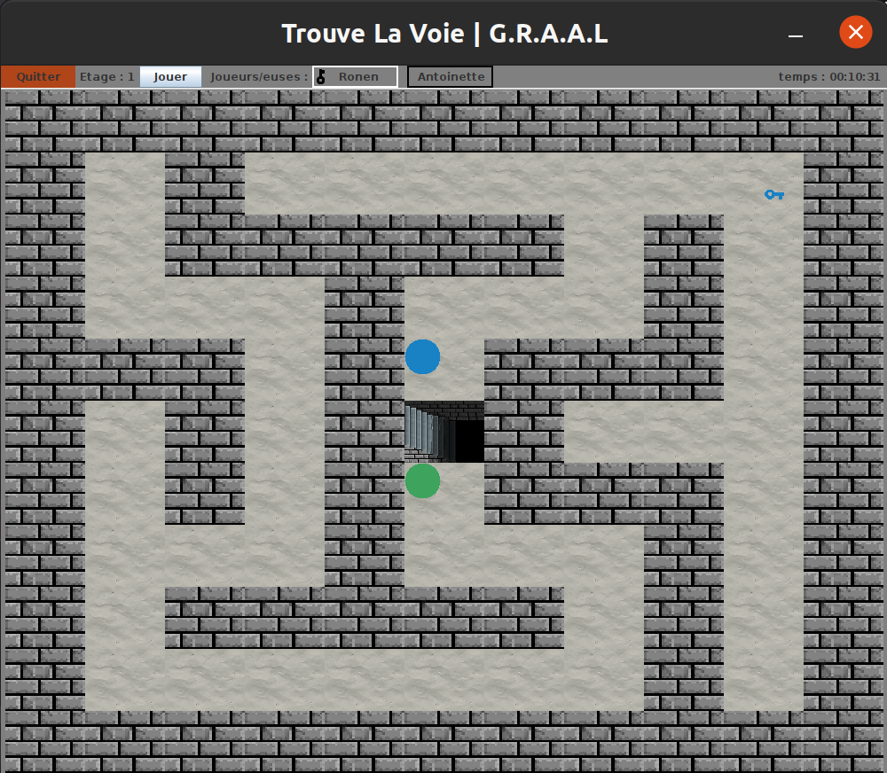
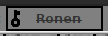

# Trouve la voie

groupe SB1-B : Georges Lecomte, Ronen Shay, Alec Martinez, Antoinette Fourmond, Lea Benoiton

1. [Lancement du logiciel]
2. [Présentation du logiciel]
3. [Utilisation du logiciel]

## Lancement du logiciel :

On fera juste un .jar à exécuter ? Je vous laisse voir...

## Présentation du logiciel :

Notre logiciel est un jeu de labyrinthe dans lequel les joueurs doivent être reconnus par leur voix pour pouvoir jouer, et jouable uniquement grâce à des commandes vocales.

Seuls les joueurs enregistrés dans le logiciels peuvent donc participer.

Le but du jeu est d'arrivé au bout du labyrinthe, composé de trois étages, chacun plus grand que le précédent. À chaque étage, tout les joueurs commencent au centre du labyrinthe, et doivent aller chercher la clef de leur couleur afin d'ouvrir la sortie, avant de revenir au centre du labyrinthe pour prendre l'escalier et accéder à l'étage suivant.

Chaque partie est chronométrée afin que les joueurs puissent connaître le temps qu'ils ont mis à finir le jeu et essayer de battre leur record.

## Utilisation du logiciel :

### Ecran titre

En lançant le logiciel, l'utilisateur se retrouve sur un menu d'écran titre avec différents boutons : un bouton "Jouer" pour lancer le jeu, un bouton "Scores" pour afficher les meilleurs scores, un bouton "Credit" pour afficher les noms des personnes ayant participé au projet, et un bouton "Quitter" pour fermer le logiciel.

Ecran titre : 

### Selection des joueurs

En cliquant sur jouer, on arrive sur la page de sélection des joueurs. On peut alors cocher / décocher les joueurs qui participeront, mais notre logiciel a une petite particularité : lorque l'on essaye de cocher un joueur, un enregistrement de 10 secondes pendant lequel le joueur devra parler va se lancer. À la fin des 10 secondes, le logiciel cochera le joueur uniquement si sa voix a été reconnue. Une fois que tous les participants ont été cochés, on peut appuyer sur le bouton "le nom du bouton qui lance la partie lorsque tous les joueurs ont été cochés" pour lancer la partie.

Sélection des joueurs :

### Ecran du jeu

Le jeu se lance et on arrive enfin dans le labyrinthe. Chaque joueur est représenté par une pastille de couleur, et il y a également une clé de chaque couleur que chaque joueur doit aller chercher. En haut de la fenêtre de jeu, on retrouve plusieurs boutons et informations. En partant de la gauche il y a : le bouton "Quitter", pour mettre fin à la partie et revenir à l'écran titre, l'étage actuel du labyrinthe dans lequel on est, le bouton "Jouer", qui lance un enregistrement, la liste des joueurs, et le timer.

Les joueurs jouent chacun leur tour, et le joueur courant est encadré en blanc dans la liste des joueurs. Quand c'est à son tour, le joueur courant doit cliquer sur le bouton "Jouer" pour lancer un enregistrement, car c'est la que les commandes vocales interviennent. L'enregistrement dure 3 secondes, pendant lesquelles le joueur doit prononcer une commande vocale de la forme : "Je vais à/en haut/bas/gauche/droite". Après environ 10 secondes, le jeu reconnaitra la commande vocale et déplacera le joueur en fonction, avant de passer au joueur suivant.

Lorsqu'un joueur a ramassé sa clé, une icone de clé apparait à côté de son nom dans la liste des joueurs, et une fois qu'il est revenu à l'escalier, son nom est barré et il ne peut plus jouer jusqu'à la fin de l'étage. L'étage change une fois que tous les joueurs ont récupéré leur clé et sont revenus au milieu.

Dans ce screenshot, Ronen et Antoinette jouent, c'est au tour de Ronen qui a récupéré sa clé et revient vers l'escalier, alors qu'Antoinette va récupérer la sienne : 

Une fois que Ronen est revenu à l'escalier, son nom est barré :

La partie prend fin lorsque les joueurs ont fini le troisième étage.
