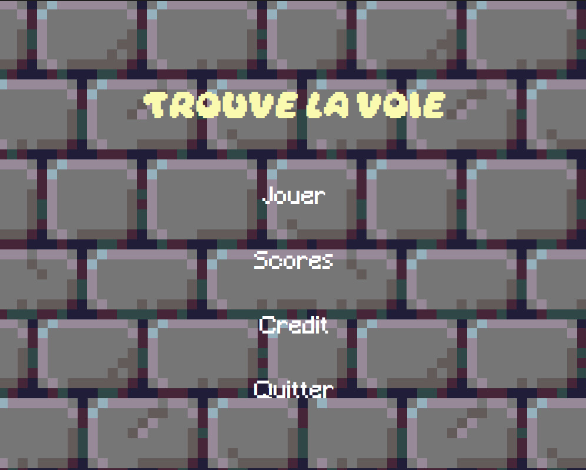

# Trouve la voie

groupe SB1-B : Georges Lecomte, Ronen Shay, Alec Martinez, Antoinette Fourmond, Lea Benoiton

1. [Lancement du logiciel]
2. [Présentation du logiciel]
3. [Utilisation du logiciel]

## Lancement du logiciel :

On fera juste un .jar à exécuter ? Je vous laisse voir...

## Présentation du logiciel :

Notre logiciel est un jeu de labyrinthe dans lequel les joueurs doivent être reconnus par leur voix pour pouvoir jouer, et jouable uniquement grâce à des commandes vocales.

Seuls les joueurs enregistrés dans le logiciels peuvent donc participer.

Le but du jeu est d'arrivé au bout du labyrinthe, composé de trois étages, chacun plus grand que le précédent. À chaque étage, tout les joueurs commencent au centre du labyrinthe, et doivent aller chercher la clef de leur couleur afin d'ouvrir la sortie, avant de revenir au centre du labyrinthe pour prendre l'escalier et accéder à l'étage suivant.

Chaque partie est chronométrée afin que les joueurs puissent connaître le temps qu'ils ont mis à finir le jeu et essayer de battre leur record.

## Utilisation du logiciel :

En lançant le logiciel, l'utilisateur se retrouve sur un menu avec différents boutons : un bouton "Jouer" pour lancer le jeu, un bouton "Scores" pour afficher les meilleurs scores, un bouton "Credit" pour afficher les noms des personnes ayant participé au projet, et un bouton "Quitter" pour fermer le logiciel.

